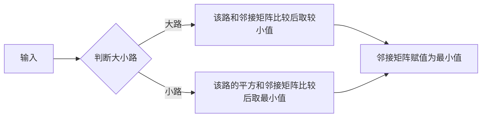

#  实验七       **图的应用二（行车路线）** 

### 【问题描述】

 小明和小芳出去乡村玩，小明负责开车，小芳来导航。
　　小芳将可能的道路分为大道和小道。大道比较好走，每走1公里小明会增加1的疲劳度。小道不好走，如果走小道，小明的疲劳值会快速增加，走*s*公里小明会增加*s*2的疲劳度。所有的小道不相交。
　　例如：有5个路口，1号路口到2号路口为小道，2号路口到3号路口为大道，3号路口到4号路口为大道，4号路口到5号路口为小道，相邻路口之间的距离都是2公里。如果小明从1号路口到5号路口，则总疲劳值为22+2+2+22=4+2+2+4=12。
　　现在小芳拿到了地图，请帮助她规划一个开车的路线，使得按这个路线开车小明的疲劳度最小。 


### 【输入形式】

 输入的第一行包含两个整数*n*, *m*，分别表示路口的数量和道路的数量。路口由1至*n*编号，小明需要开车从1号路口到*n*号路口。
　　接下来*m*行描述道路，每行包含四个整数*t*, *a*, *b*, *c*，表示一条类型为*t*，连接*a*与*b*两个路口，长度为*c*公里的双向道路。其中*t*为0表示大道，*t*为1表示小道。保证1号路口和*n*号路口是连通的。 


### 【 输出形式】

 输出一个整数，表示最优路线下小明的疲劳度 


### 【样例输入】

输入：

6 7
1 1 2 3
0 2 3 2
0 1 3 30
0 3 4 20
0 4 5 30
1 3 5 6
0 5 6 1

### 【样例输出】

 48 


---

### 题目分解

读完题，我们首先进行问题的分析。

### - 处理的数据

我们观察到，此题中，实质是要求我们求一个从1节点（0号）到n节点（n-1号）的最短路径问题，我们要做的只是对不同的数据输入形式进行相应的转化。

此题中，我们最大的疑惑就在于大小路问题，因此，我们解题的难点就是把大小路距离转化为相应的距离，然后存进邻接矩阵（或者其他存储方式），然后求其最短路径即可。

### -实现的功能

我们要做到的功能，就是把存进邻接矩阵的数值，求两点之间的最短距离。

结果可以直接显示输出即可。


---

### 算法的设计分析

这是一道图论的问题，因此我们用到的是图论的ADT，我们只需要借助上次实验使用的邻接矩阵的ADT即可。


**具体分析**

我们首先按照上文说的，把数据处理后，存入邻接矩阵，存入的考虑过程如下。

若该路为大路，则比较该路和邻接矩阵中已有的通路比较，取其最小值

若该路为小路，则比较该路的平方和邻接矩阵中已有的通路比较，取其最小值

其流程图和伪代码简化如下



```c++
for(int i=0;i<m;i++)
	{
		int t,a,b,c;
		cin >>t>>a>>b>>c;
		if(t==0)
		{
			int min_num=min(x.matrix[a-1][b-1],c);
			x.setEdge(a-1,b-1,min_num); 
			x.setEdge(b-1,a-1,min_num); 
		}
		else if(t==1)
		{
			c=c*c;
			int min_num=min(x.matrix[a-1][b-1],c);
			x.setEdge(a-1,b-1,min_num); 
			x.setEdge(b-1,a-1,min_num); 
		}
	}
```


我们将处理后数据存入邻接矩阵后，然后要考虑的便是数据的求解算法、

前文已经分析得到，我们要做的是求两点之间的最短路径，我们采用 弗洛伊德算法（简单粗暴）实现它

（没有难度）

```c++
 for (int k=0; k<n; k++) {
        for (int i=0; i<n; i++) {
            for (int j=0; j<n; j++) {
                if (i == j) {
                    continue;
                }
                if (x.matrix[i][k]!=-1 && x.matrix[k][j]!=-1) {
                	int min_num=min(x.matrix[i][j], x.matrix[i][k]+x.matrix[k][j]);
                    x.setEdge(i,j,min_num);
                }
            }
        }
    }
```


最后输出邻接矩阵 x[0] [n-1]即可。

---

## 总结

本题属于简单的读题问题，没有太大的难度。

只需要把数据合适处理，存入邻接矩阵，再通过相应的算法求解即可


踩坑：

​        做此题时，仅踩过一个坑，原因是在邻接矩阵之前用时，求最短路径，没有初始化，导致路径全部为0，同时比较出错，内存崩。修改过后，通过。