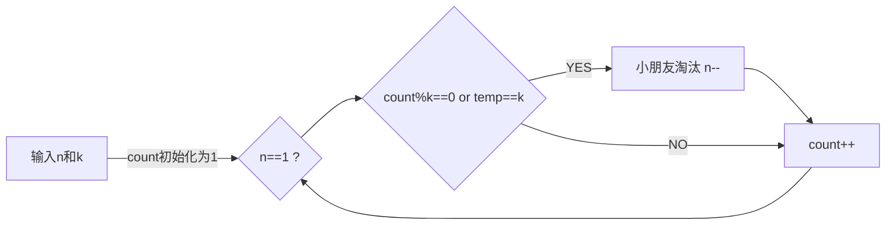

## 实验二 游戏


### 问题描述

基于STL实现以下功能：有*n*个小朋友围成一圈玩游戏，小朋友从1至*n*编号，2号小朋友坐在1号小朋友的顺时针方向，3号小朋友坐在2号小朋友的顺时针方向，……，1号小朋友坐在*n*号小朋友的顺时针方向。

　　游戏开始，从1号小朋友开始顺时针报数，接下来每个小朋友的报数是上一个小朋友报的数加1。若一个小朋友报的数为*k*的倍数或其末位数（即数的个位）为*k*，则该小朋友被淘汰出局，不再参加以后的报数。当游戏中只剩下一个小朋友时，该小朋友获胜。


### 问题分析

根据题意分析，小朋友一个接一个围成一个环，且报数不需要清零，只需要累计，直到满足 报数为*k*的倍数或其末位数 ， 则该小朋友出局，（在今后的报数中，忽略不报），一直到最后只剩下一个小朋友。

其重点如下

- 最后一个小朋友相邻第一个小朋友
- 出局以后报数不会清零
- 直到只剩下最后一个小朋友，输出小朋友的编号


#### 题目样例分析

```analyse
5 2
```

- 当n=5，k=2

> 1号小朋友报数1；
> 2号小朋友报数2淘汰；
> 3号小朋友报数3；
> 4号小朋友报数4淘汰；
> 5号小朋友报数5；
> 1号小朋友报数6淘汰；
> 3号小朋友报数7；
> 5号小朋友报数8淘汰；
> 3号小朋友获胜。 


### 数据结构和算法设计


#### 题目要求基于STL实现

发现题目要求不高，并且小朋友淘汰是队伍中间淘汰，因此选用list链表作为实验的主要结构。


#### 算法思想设计

- 我们只需要计数，

- 计数到对应值(满足条件)

- 淘汰相应小朋友（删除链表的对应节点）

- 直到最后只剩下唯一节点（唯一小朋友），

  

  其中末位可用 temp=k-10*(k/10)得到（int整型的特点）

  该计数值要求每次递增1


画出其流程图如下





其伪代码如下

```c++
	list<int> a;
	int n,k;
	cin >> n>>k;
	for(int i=0;i<n;i++)
	{
		a.push_back(i+1);
	}
	if(n==1){
		cout << a.front();
		a.clear();
		return 0;
	}
	int sum=1;
	list<int>::iterator it=a.begin();
	while(a.size()>1)
	{
		if(sum%k==0 || sum-10*(sum/10)==k)
		{
			it=a.erase(it);
		}
		else it++;
		sum++;
		if(it==a.end()) it=a.begin();
	}
	cout << *it;
	return 0;
```

---


### 算法性能分析


本题中，算法性能（时间复杂度）一般，和普通的方法差不多，不过最后所用的空间代价比普通方法少一些。

算法运行效率可能比不上数学推断方法得到的结果，不过可以更简单的理解代码

