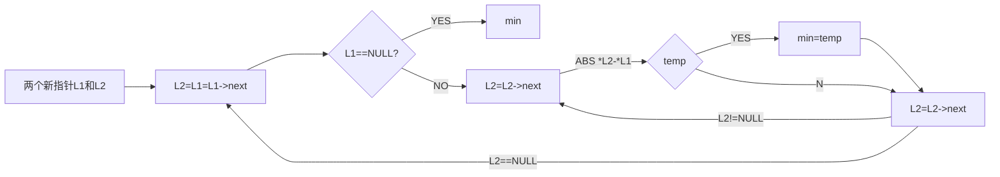

## 实验二---最小差值


##### 题目描述

 必须利用实验一实现的线性表ADT，完成下面的题目。

  对于给定*n*个数，请找出其中相差（差的绝对值）最小的两个数，输出它们的差值的绝对值。

---


##### 题目分析

观察到题目要求必须使用实验一实现的线性表ADT，回想实验一实现的线性表ADT，是利用链表实现的数据的查类型和删除。此题中，需要查找相差最小的两个数,原定义的链表ADT中没有相关数据，所以想到比较简单的方法即遍历，分析其平均复杂度为O(n)=n^2

不难想到，此题要求的就是

- 用两个指针存储两个节点，且节点二从节点一的下一位开始，进行遍历，求两个节点对应值的差值，如果小于min，则赋值给min。
- 遍历结束，输出min即可。
- 

对本题中案例，进行分析模拟过程如下。(为方便模拟显示，temp代表temp节点所指值)

```analyse
n = 5
1 5 4 8 20
```

```analyse
min=9999999999;
temp1=temp2=1;
temp2=5; t=5-1=4<min --> min =4;
temp2=4; t=4-1=3<min --> min =3;
temp2=8; t=8-1=7>min
temp2=20; t=20-1=19>min;

temp1=5;
temp2=4; t=5-4=1<min --> min=1;
........
min=1;
```

---

##### 数据结构设计


*顶层图设计如下*


顶层图伪代码如下

```c++
	LList<int> a;
	int n;
	cin >> n;
	for(int i=0;i<n;i++)
	{
		int x;
		cin >> x;
		a.append(x);
	}
	cout<<a.min_();
```


***

下面进行分层函数的设计模块

链表的尾插入和链表的ADT声明不再赘述，伪代码如下

```c++
void append(const E& it)
{
			tail = tail->next = new Link<E>(it,NULL);
}
```

下面重点说本次实验任务重点，求最小值的函数min_


* 通过上文分析，得到步骤如下

1. > 申请两个新的节点的指针，指向头节点

2. > 指针二指向指针一的下一个指针

3. > 求指针二和指针一的差值，并将差值取绝对值

4. > 若绝对值小于当前最小值，则当前最小值＝绝对值

5. > 指针二指向指针二的下一个指针，重复4，5，直到指针二指针为空

6. > 指针一指向指针一的下一个指针，重复2-5，直到指针一为空

7. > 输出最小值


画出其逻辑结构图如下



其伪代码如下

```c++
int  min_()
		{
			int min=99999999;
			Link<E>* temp1=head->next;
			Link<E>* temp2=head->next;
			for(temp1=head->next; temp1!=NULL; temp1=temp1->next)
			{
				for(temp2=temp1->next; temp2!=NULL; temp2=temp2->next)
				{
					int te=temp1->element - temp2->element;
					if(te<0) te=-te;
					if(te < min ) min=te;
				}
			}
			return min;
		}
```

---

#### 算法性能分析


数据输入的时间复杂度为N

min函数的时间复杂度为 N(N-1)/2; （第二个内层循环为半个整循环）

则其算法复杂度为 O(N)=N^2

