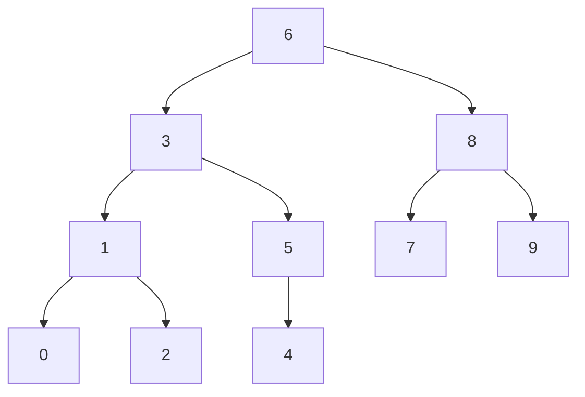
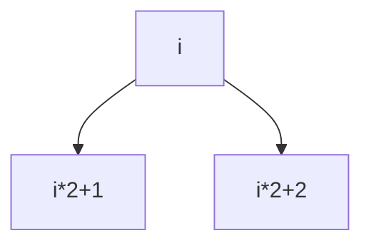

# 实验四二叉树的应用（BST）

### 问题描述


**二叉搜索树（BST）**定义为具有以下属性的二叉树：

> 任意节点的左子树不空，则左子树上所有节点的值均小于它的根节点的值
>
>  任意节点的右子树不空，则右子树上所有节点的值均大于它的根节点的值
>
>  任意节点的左、右子树也分别为二叉查找树

 

完全二叉树（CBT）的深度为k，除第k层外，其他各层（1～（k-1）层）的节点数都达到最大值，且第k层所有的节点都连续集中在最左边。

 

现在，给定一个键值互不相同的非负整数序列，构造一颗**树既是CBT，也是BST**。请你输出这个BST的**层次**遍历序列。


---

### 题目样例分析


> 样例输入
>
> > 10
> >
> > 1 2 3 4 5 6 7 8 9  0
>
> 样例输出
>
> > 6 3 8 1 5 7 9 0 2 4


---

### 分解样例


首先直接看样例的输出，我们得不到结论，不如首先按照样例，将**符合要求的树**构建出来，再观察这棵树，找到相应规律，再写相应的递归函数


因为本树是一个具有**二叉搜索树性质的完全二叉树**，我们先将给的数据进行大小排序

> 0 1 2 3 4 5 6 7 8 9 

然后分析我们最后需要构建成的树 (a \ b  表示， 该点的 值 为 a，该点的序号为 b)



发现

如果按照该构成树的中序遍历输出，那么就是我们输入的数组，因此，又因为这个树的结构首先是一个**完全二叉树**

因此，不难想到，只需要我们


>1. 构建出来这个完全二叉树，
>2. 再根据完全二叉树的中序遍历，对树的节点进行填值
>3. 层次化输出该树

即可达到我们想要的结果


---

### 算法思想和结构设计


根据上文所说，我们只需要进行下面三步，即可

>1. 构建出来这个完全二叉树，
>2. 再根据完全二叉树的中序遍历，对树的节点进行填值
>3. 层次化输出该树


#### 算法的设计思想

- 这是一棵**完全二叉树**，本题的数据结构就是**完全二叉树**

- - 因此，我们需要构建该**完全二叉树**
- 这棵完全二叉树的**中序遍历**的输出结果，就是我们所需要的结果，也是我们输入数组的**升序数组**
- - 我们要把我们数组的**升序数组**，按照**中序遍历**的顺序，赋值给该完全二叉树 
- 层次化输出该树

---


#### 结构设计

ADT 我们采用的是完全二叉树，因此，我们需要完全二叉树的ADT声明如下

```c++
class node{
	private:
	int data;
	int height; //(没用到)
	node* left; 
	node* right; 
```


和普通的树一样，**数据域** 和 **左右子树**


又因为 完全二叉树的子树节点有以下关系




根据这个关系，我们写出递归构建完全二叉树的函数如下

```c++
node* node::create(int index,int n){
	if(index >= n)
	{
		return NULL; 
	}
	int l=index*2+1;
	int r=index*2+2;
	node* root = new node;
	root->left = create(l,n);
	root->right = create(r,n);
	return root; 
} 
```

其中，因为我们是根据数组构建完全二叉树，我们就知道了完全二叉树的节点数目，以此作为递归的终止判断条件


到这里，我们的完全二叉树就已经构建完毕，下面我们需要根据完全二叉树的中序遍历给它赋值

```c++
void node::inOrder(node*tmp , int t[])
{
	if (tmp == NULL)
		return;
	
	inOrder(tmp->le(),t);
	tmp->data=t[pos++];
	inOrder(tmp->ri(),t);
}
```

易得，数组t[]，即相当于我们输入数组的**升序排列数组**,将**中序遍历赋值赋值给它，即可**


层次化输出代码根据上次实验，易得如下

```c++
void node::levelorder(node *root){
	node *queue[31];                      
	int front =0, rear = 0;                 
    rear = (rear +1) % 31;
	queue[rear] = root;                    
	node *p;
	while(front != rear){
  		front = (front + 1)%31;
  		p = queue[front];
  		printf("%d ", p->data);
  		if(p->left != NULL){
  		    rear = (rear + 1) % 31;
			queue[rear] = p->left;
		}
		if(p->right != NULL){
   			rear = (rear + 1) % 31;
			queue[rear] = p->right;
		}
	}
}
```


---

##### 完成实验


---

#### 实验总结


- 读清除题目要求，比如本题，实质ADT是**完全二叉树**而不是**二叉搜索树**
- 合理运用各种遍历结果 本题把中序遍历的输出改为中序赋值