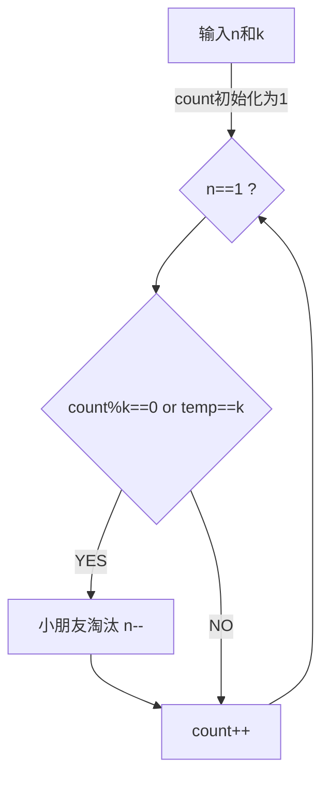

# 第四次讨论课-STL中序列式容器的剖析


## STL(标准模板库)

STL是封装好的，可以直接使用的**模板容器**的集合，STL是c++的一部分，不需要进行库的声明，可以直接使用


---

我们主要看**序列式容器**，包括了

> 向量  （vector）       连续存储的元素 <vector>
>
> 列表     (list)                由节点组成的双向链表，每个节点包含着一个元素<list>
>
> 栈         (stack)            后进先出的排列<stack>
>
> 队列     (queue)          先进先出的排列<queue>
>
> 双向队列(deque)        连续存储的指向不同元素的指针所构成的数组<deque>


分别对每个容器进行分析

---

### vector 

​                    [菜鸟教程](https://www.runoob.com/w3cnote/cpp-vector-container-analysis.html 

**什么是vector**

> 向量（Vector）是一个封装了动态大小数组的顺序容器（Sequence Container）。跟任意其它类型容器一样，它能够存放各种类型的对象。可以简单的认为，向量是一个**能够存放任意类型的动态数组** 


**vector的底层实现 **   (基于STL vector源代码 )

```c++
template<class _Ty,
    class _Ax>
    class vector
        : public _Vector_val<_Ty, _Ax>
    {   // varying size array of values
public:
    /********/
protected:
    pointer _Myfirst;   // pointer to beginning of array
    pointer _Mylast;    // pointer to current end of sequence
    pointer _Myend; // pointer to end of array
    };
```


**vector的常见函数**

> void push_back(const T& x):向量尾部增加一个元素X 
>
>  iterator insert(iterator it,const T& x):向量中迭代器指向元素前增加一个元素x 
>
>  void pop_back():删除向量中最后一个元素 
>
> iterator begin():返回向量头指针，指向第一个元素
>
> iterator end():返回向量尾指针，指向向量**最后一个元素的下一个位置**
>
>  int size() const:返回向量中元素的个数 


**常用函数的实现**

```c++
void push_back(const _Ty& _Val)
        {   // insert element at end
        if (size() < capacity())
            _Mylast = _Ufill(_Mylast, 1, _Val);
        else
            insert(end(), _Val);    //空间不足时，就会触发内存的二次分配
        }

void pop_back()
	{   // erase element at end
    	if (!empty())
   		 {   // erase last element
             _Destroy(_Mylast - 1, _Mylast);
             --_Mylast;
         }
    }
```


---

### List

引用自[c plus plus]  http://www.cplusplus.com/reference/list/list/ 


**什么是List**

> 列表是序列容器，允许在序列中的任何位置进行恒定时间的插入和擦除操作，并在两个方向上进行迭代。
>
>列表容器以双向链接列表的形式实现；双链列表可以将它们包含的每个元素存储在不同且不相关的存储位置。通过与到它前面的元素的链接和到它后面的元素的链接的每个元素的关联，在内部保持排序。
> 


**List与vector**

> list是双向链表 ，相比于vector的连续线性空间，list就显得复杂许多，她的好处是每次插入或删除一个元素，就配置或释放一个元素空间 。list对空间的运用绝对的精准，一点儿也不浪费。而且，对任何位置的元素插入或元素移除，list永远是常数时间。 


**List常用函数**

>assign() 给list赋值  
>
>back() 返回最后一个元素
>
>begin() 返回指向第一个元素的迭代器  
>
>clear() 删除所有元素  
>
>empty() 如果list是空的则返回true 
>
>end() 返回末尾的迭代器  
>
>erase() 删除一个元素  
>
>front() 返回第一个元素 
>
>pop_back() 删除最后一个元素 
>
>pop_front() 删除第一个元素
>
>push_back() 在list的末尾添加一个元素
>
>push_front() 在list的头部添加一个元素  
>
>


**List常见函数实现**

```c++
iterator insert(iterator position, const T& x){//在迭代器position所指位置插入一个节点，内容为x  
      link_type tmp = create_node(x);  
      tmp->next = position.node;  
      tmp->prev = position.node->node;  
      (link_type(position.node->prev))->next = tmp;  
      return tmp;  
  }

 void push_back(const T& x) {insert(end(),x);}

void push_front(const T&x){  
  insert(begin(),x);  
  }
```


---

### Stack(栈)


**什么是stack**

>  堆栈是一个线性表，插入和删除只在表的一端进行。这一端称为栈顶(Stack Top)，另一端则为栈底(Stack Bottom)。堆栈的元素插入称为入栈，元素的删除称为出栈。由于元素的入栈和出栈总在栈顶进行，因此，堆栈是一个后进先出(Last In First Out)表，即 LIFO 表。
>
> 
>
>    C++ STL 的堆栈泛化是直接通过现有的序列容器来实现的，默认使用双端队列deque的数据结构，当然，可以采用其他线性结构（vector 或 list等），只要提供堆栈的入栈、出栈、栈顶元素访问和判断是否为空的操作即可。由于堆栈的底层使用的是其他容器，因此，堆栈可看做是一种适配器，将一种容器转换为另一种容器(堆栈容器)。 


**stack的常用函数**

>empty() 堆栈为空则返回真
>
>pop() 移除栈顶元素
>
>push() 在栈顶增加元素
>
>size() 返回栈中元素数目
>
>top() 返回栈顶元素


---

### queue(队列)


**什么是queue**

> 队列是一种**先进先出** (FIFO) 的数据结构，它允许在一端插入数据，在另一端删除数据。最先进入队列的数据最先出队列。除此之外，队列还允许访问队头元素和队尾元素、获取队列长度和判断空列队等操作。
> **队列不提供遍历的方法，也不提供迭代器。** 


**队列的基本函数**

>back() 返回最后一个元素
>
>empty() 如果为空返回真
>
>front() 返回第一个元素
>
>pop() 删除第一个元素
>
>push() 在末尾加入一个元素
>
>size() 返回队列元素的个数


---

### deque(双向队列)


**什么是deque**

>  deque（双端队列）是由一段一段的定量连续空间构成，可以向两端发展，因此不论在尾部或头部安插元素都十分迅速。 在中间部分安插元素则比较费时，因为必须移动其它元素。 


**deque的基本函数**


> 容器大小：`deq.size();` 
>
> 容器判空：`deq.empty();` 
>
> 头部添加元素：`deq.push_front(const T& x);` 
>
> 末尾添加元素：`deq.push_back(const T& x);` 
>
> 头部删除元素：`deq.pop_front();` 
>
> 末尾删除元素：`deq.pop_back();` 


---


### STL的基本使用


##### 问题描述

>有n个小朋友围成一圈玩游戏，小朋友从1至n编号，2号小朋友坐在1号小朋友的顺时针方向，3号小朋友坐在2号小朋友的顺时针方向，……，1号小朋友坐在n号小朋友的顺时针方
>向。
>
>游戏开始，从1号小朋友开始顺时针报数，接下来每个小朋友的报数是上一个小朋友报的数加1。若
>一个小朋友报的数为k的倍数或其末位数（即数的个位）为k，则该小朋友被淘汰出局，不再参加以后的
>报数。当游戏中只剩下一个小朋友时，该小朋友获胜。


##### 问题分析

>根据题意分析，小朋友一个接一个围成一个环，且报数不需要清零，只需要累计，直到满足 报数为k的
>倍数或其末位数 ， 则该小朋友出局，（在今后的报数中，忽略不报），一直到最后只剩下一个小朋
>友。
>其重点如下
>
>- 最后一个小朋友相邻第一个小朋友
>- 出局以后报数不会清零
>- 直到只剩下最后一个小朋友，输出小朋友的编号
>- - 其中末位可用 temp=k-10*(k/10)得到（int整型的特点）
>    该计数值要求每次递增1

画出其流程图如下




**其代码如下**

```c++
list<int> a;
	int n,k;
	cin >> n>>k;
	for(int i=0;i<n;i++)
	{
		a.push_back(i+1);
	}
	if(n==1){
		cout << a.front();
		a.clear();
		return 0;
	}
	int sum=1;
	list<int>::iterator it=a.begin();
	while(a.size()>1)
	{
		if(sum%k==0 || sum-10*(sum/10)==k)
		{
			it=a.erase(it);
		}
		else it++;
		sum++;
		if(it==a.end()) it=a.begin();
	}
	cout << *it;
	return 0;
```

