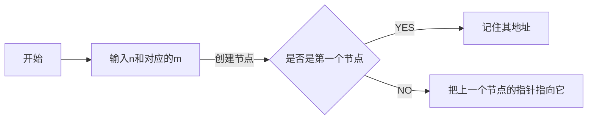
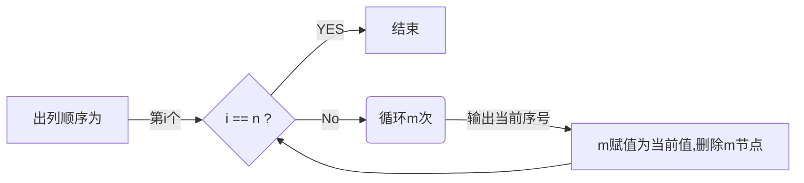

# 数据结构与算法设计讨论（第六周）


### 题目背景


​                                                        **约瑟夫环（循环链表实现）**

编号为1 2 ......n 的 n 个人按顺时针方向围坐一圈，每人持一个密码（正整数）。一开始任选一个正整数作为报数上限值 m ，从第一个人开始按顺时针方向自 1 开始顺序报数，报到 m 时停止报数。报 m的人出列，将他的密码作为新的 m 值，从他在顺时针方向上的下一个人开始重新从 1 报数，如此下去，直至所有人全部出列为止


---

### 算法设计思想

经典约瑟夫环问题，检测一圈以后需要从头重新开始检测，使用循环链表，储存编号和相应密码，尾节点连接头节点。

需要有如下子函数模块

-  新链表节点的创建
- 出列节点的删除
- 判断出列模块


### 数据结构的设计和表述

本题采用循环链表的数据结构，本质上就是链表结构，最简单的链表就是多个节点类(结构体)线性相指形成的结构，在本题中，需要存储内容有 id，num(每个人的密码)，下一个节点的指针域。

**结构体节点的声明**

```c++
struct node
{
   int no;    //代表编号结点的数据
   int code;  //代表密码结点的数据
   node *next;//代表后一个结点的地址
};
```

**数据结构声明如下**



```c++
for(i=1;i<=n;i++)
   {
        if(i==1)
        {
            first=p=(node*)malloc(sizeof(node));
            if(p==0)
                return 0;
        }
        else
        {
            q=(node*)malloc(sizeof(node));
            if(q==0)
                return 0;
            p->next=q;
            p=q;
        }
        cout<<"请输入第 "<<i<<" 个人的密码: ";
        cin>>(p->code);
        p->no=i;
   }
```

---


**算法声明如下**

所有人都要以此出队，则一共要出队n次，每次计数到m次出列一个，同时将出列的值保存为当前m，删除出列节点。



```c++
for (j=1;j<=n;j++)
   {
        for(i=1;i<m;i++,p=p->next);
        m=p->code;
        cout<<p->no<<" ";
        p->no=p->next->no;
        p->code=p->next->code;
        q=p->next;
        p->next=p->next->next;
        free(q);
   }
```

---

### 测试样例的设置

测试样例设置，要尽可能多，尽可能考虑到更多的情况，考虑极限问题和边缘问题，考虑尽可能多的特殊情况，考虑一般数据的规模大小，既要有普通测试规模的小数据，也要有大规模的测试数据，以便检测算法的运行效率。

**在此题中，部分样例设置如下**

- *n=1，即只有一个人*

- *初始m=0*

- *一般数据m=0的时候*

- *正常数据，n= 7 ，m分别为3，1，7，2，4，8，4*

  

### 数据的调试

针对数据的调试，带有指针的数据调试，使用**c++**自带的调试功能，并不太容易实现，要求自己头脑清楚，手动模拟相关过程，可以在调试过程中不间断输出值，观察输出值和自己想法值的区别，调整算法结构

---

### 实验日志的编写

实验日志记录，主要记录以下数值

- 日期
- 实验模块有哪些变动，修改了什么部分

- 遇到了哪些问题，有没有解决问题，是怎么解决的
- 写的代码块的注释和markdown文档，以助于他人查看


### 总结

在做有关于ADT的实验(题目时)，要先考虑算法实现思想，考虑怎么样通过一个ADT去实现这个算法，进而画出算法的流程图，根据流程图，可以清晰算法的逻辑结构，进而写出算法的伪代码实现。

---

​    *部分资料摘自     [ [蚂蚁辣舞]的CSDN]  https://blog.csdn.net/changgui5211/article/details/47150289*